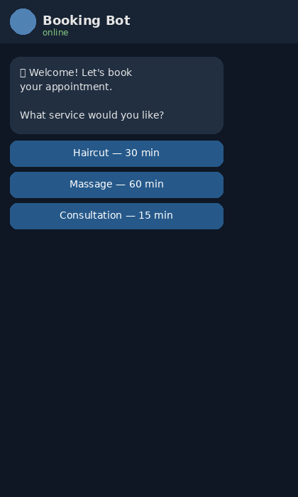
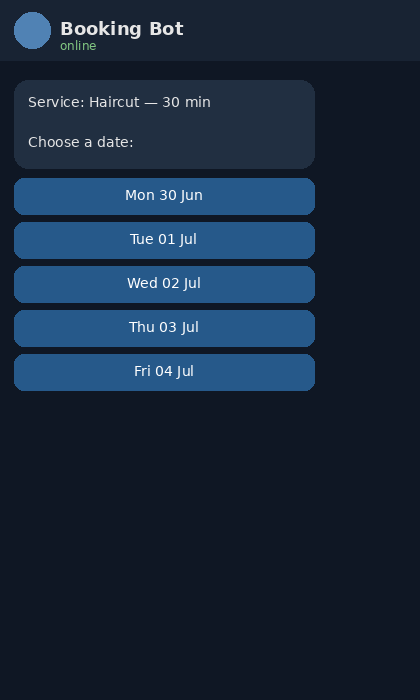
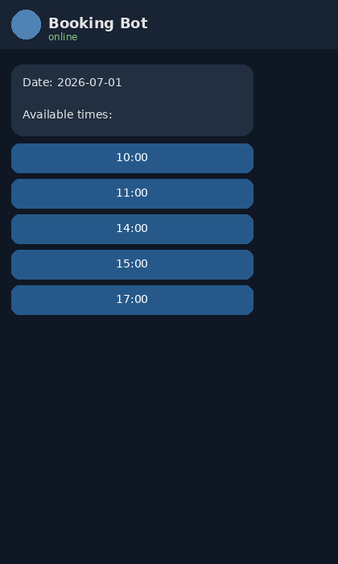
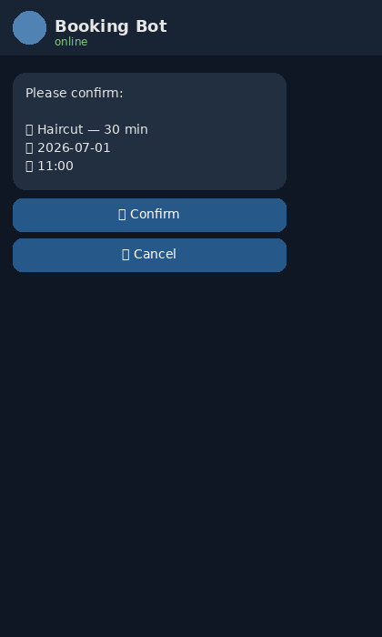
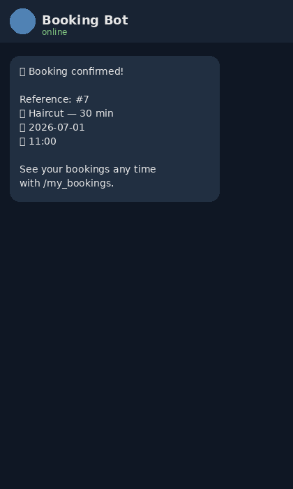
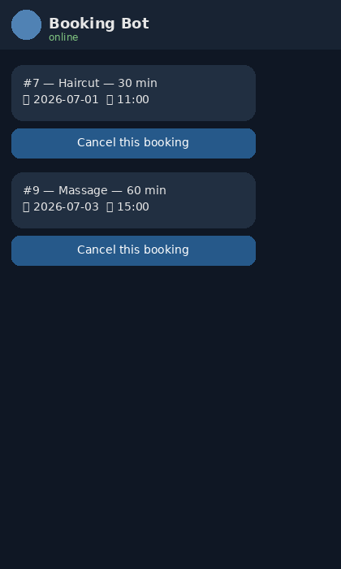

# Telegram Appointment / Order-Taking Bot

A Telegram bot that walks a user through booking an appointment (or placing an order)
using inline buttons, stores all state in SQLite, and sends a confirmation message
once the booking is complete.

Built with [python-telegram-bot](https://github.com/python-telegram-bot/python-telegram-bot) v21.

## Features

- Guided multi-step booking flow using a `ConversationHandler`: service → date → time → confirm
- Inline keyboard buttons at every step (no free-text parsing needed)
- SQLite storage of bookings (`bot/database.py`), swappable for Postgres later
- Double-booking protection — already-taken slots are filtered out of the time picker
- `/my_bookings` to list and cancel existing bookings
- `/cancel` to bail out of the flow at any point

## Conversation flow

| Step | Screenshot |
|---|---|
| 1. Choose a service |  |
| 2. Choose a date |  |
| 3. Choose a time slot |  |
| 4. Confirm details |  |
| 5. Booking confirmed |  |
| 6. View / cancel bookings |  |

## Project structure

```
telegram-booking-bot/
├── bot/
│   ├── __init__.py
│   ├── config.py        # env vars, services, available slots
│   ├── database.py       # SQLite schema + queries
│   └── handlers.py       # ConversationHandler: all bot dialogue logic
├── screenshots/           # mock UI screenshots used in this README
├── main.py                 # entry point, wires everything together
├── requirements.txt
├── .env.example
└── .gitignore
```

## Setup

1. Create a bot with [@BotFather](https://t.me/BotFather) on Telegram and copy the token it gives you.
2. Clone the repo and install dependencies:
   ```bash
   git clone https://github.com/<your-username>/telegram-booking-bot.git
   cd telegram-booking-bot
   python3 -m venv .venv && source .venv/bin/activate
   pip install -r requirements.txt
   ```
3. Copy `.env.example` to `.env` and paste your bot token:
   ```bash
   cp .env.example .env
   # then edit .env and set BOT_TOKEN=...
   ```
4. Run it:
   ```bash
   python main.py
   ```
5. Open Telegram, find your bot, and send `/start`.

## Commands

- `/start` or `/book` — start a new booking
- `/my_bookings` — list your active bookings, with a cancel button on each
- `/cancel` — abort the current booking flow

## Customizing

Edit `bot/config.py` to change the list of services (`SERVICES`) and the available
time slots (`AVAILABLE_SLOTS`). Date options currently default to the next 5 days
(`bot/handlers.py::_date_options`) — change the range there if you need a longer window.

## Swapping SQLite for Postgres

`bot/database.py` is intentionally small and isolated — all DB access goes through
it. To move to Postgres, replace the `sqlite3` connection in `get_conn()` with
`psycopg2`/`asyncpg`, keeping the same function signatures, and the rest of the bot
doesn't need to change.

## License

MIT
